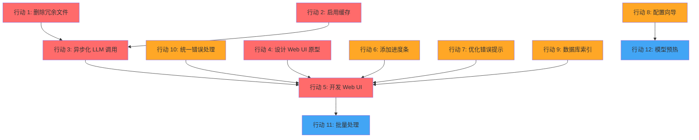

# Video-to-Action 落地执行计划

**文档版本**：v1.0  
**制定日期**：2026-06-26  
**制定人**：路径（Roadie）— 路线图规划师  
**审核人**：待定  
**执行周期**：10 周（2026-07-01 ~ 2026-09-12）

---

## 📋 修订历史

| 版本 | 日期 | 修订内容 | 修订人 |
|------|------|----------|--------|
| v1.0 | 2026-06-26 | 初始版本 | 路径（Roadie） |

---

## 1. 执行概览

### 1.1 总体时间窗

**建议执行周期：10 周**（以 2 周为 1 个 Sprint，共 5 个 Sprint）

| 阶段 | 时间 | 核心目标 |
|------|------|----------|
| Sprint 1 | 第 1-2 周 | 基础设施清理 + 异步化改造 |
| Sprint 2 | 第 3-4 周 | Web UI 开发（上） |
| Sprint 3 | 第 5-6 周 | Web UI 开发（下） + 用户体验优化 |
| Sprint 4 | 第 7-8 周 | 高级功能 + 性能优化 |
| Sprint 5 | 第 9-10 周 | 测试加固 + 文档完善 + 发布准备 |

### 1.2 资源假设

**场景 A：最小团队（1 名全栈工程师）**

| 角色 | 人数 | 技能要求 | 投入度 |
|------|------|----------|--------|
| 全栈工程师 | 1 | Python（FastAPI）+ 基础前端（React/Vue） | 100% |

- **适用场景**：预算有限、功能优先级明确的初创项目
- **时间影响**：执行周期可能延长至 12-14 周
- **风险提示**：全栈工程师在 Web UI 开发阶段可能成为瓶颈

**场景 B：标准团队（2 名工程师）**

| 角色 | 人数 | 技能要求 | 投入度 |
|------|------|----------|--------|
| 后端工程师 | 1 | Python、FastAPI、异步编程、数据库优化 | 100% |
| 前端工程师 | 1 | React/Vue、TypeScript、WebSocket、UI/UX 基础 | 100% |

- **适用场景**：追求交付速度和质量的典型配置
- **时间影响**：可按 10 周计划执行
- **优势**：前后端并行开发，效率最高

**场景 C：理想团队（3 名工程师 + 1 名设计师）**

| 角色 | 人数 | 技能要求 | 投入度 |
|------|------|----------|--------|
| 后端工程师 | 1 | Python、FastAPI、异步编程、数据库优化 | 100% |
| 前端工程师 | 1 | React/Vue、TypeScript、WebSocket | 100% |
| UI 设计师 | 1 | Figma、用户体验设计、设计系统 | 50%（前 4 周） |
| 测试工程师 | 1 | 自动化测试、API 测试、E2E 测试 | 50%（后 4 周） |

- **适用场景**：追求产品级质量的商业化项目
- **时间影响**：可按 8-10 周计划执行
- **优势**：设计专业、测试充分、代码质量高

**本计划默认采用场景 B（标准团队）**，如需调整请参考"资源分配矩阵"章节。

### 1.3 核心目标

**本周期结束时要达到的状态**：

1. **产品级 Web UI**：用户无需命令行即可完成视频分析和操作方案生成
2. **性能提升 40%+**：异步化 LLM 调用，支持并发处理
3. **用户体验跃升**：进度可视化、错误提示清晰、配置简单
4. **代码质量改善**：冗余文件清理、错误处理统一、数据库优化
5. **可维护性提升**：测试覆盖率 > 80%、文档完善

**成功标准**：

- ✅ Web UI 上线，支持完整业务流程（视频输入 → 分析 → 查看结果）
- ✅ 处理速度提升 40%（通过异步化和缓存）
- ✅ 用户完成首次配置的时间从 30 分钟降至 5 分钟
- ✅ 零 P0 Bug，P1 Bug < 5 个

---

## 2. Sprint 规划（逐周拆分）

### Sprint 1：基础设施清理 + 异步化改造

**Sprint 目标**：清理技术债务，完成核心性能优化（异步化 LLM 调用）

**时间**：第 1-2 周（2026-07-01 ~ 2026-07-14）

**任务清单**：

| 行动编号 | 任务 | 负责人 | 工作量 | 优先级 |
|---------|------|--------|--------|--------|
| 1 | 删除冗余文件（`analyzer.py`、`FIX_*.md` 等） | 后端 | 1 天 | P0 |
| 2 | 启用分析器缓存（改 `_cache_enabled = True`） | 后端 | 0.5 天 | P0 |
| 3 | 异步化 LLM 调用（改造 `AnalyzerV2`） | 后端 | 3 天 | P0 |
| 9 | 数据库索引优化 | 后端 | 0.5 天 | P1 |
| 10 | 统一错误处理策略（定义异常类、错误码） | 后端 | 2 天 | P2 |

**交付物**：

1. 清理后的代码仓库（无冗余文件）
2. 异步化 LLM 调用模块（`AnalyzerV2.async_analyze()`）
3. 统一错误处理框架（`video_to_action/exceptions.py`）
4. 数据库索引迁移脚本
5. Sprint 1 测试报告

**验收标准（Exit Criteria）**：

- [ ] 冗余文件已全部删除或归档到 `docs/archive/`
- [ ] `AnalyzerV2` 支持异步调用（`async def analyze()`），单元测试通过
- [ ] API 层（`api/main.py`）已改造为异步，支持并发请求
- [ ] 数据库索引已添加，搜索查询性能提升 > 10x（基准测试）
- [ ] 所有模块使用统一的异常类，错误信息包含 `code`、`message`、`suggestion`
- [ ] 代码覆盖率 > 70%（核心模块）

**风险**：

| 风险 | 概率 | 影响 | 应对措施 |
|------|------|------|----------|
| 异步化改造引入 Bug | 中 | 高 | 充分单元测试 + 手动回归测试；保持同步接口作为备份 |
| 数据库索引迁移失败 | 低 | 中 | 先在测试环境验证，提供回滚脚本 |
| 错误处理改造范围大 | 中 | 中 | 分模块逐步改造，保持向后兼容 |

**Sprint 1 详细任务分解**：

```
Week 1:
  Day 1: 删除冗余文件 + 启用缓存
  Day 2-3: 异步化 LLM 调用（改造 AnalyzerV2）
  Day 4-5: 改造 API 层（api/main.py）

Week 2:
  Day 1-2: 统一错误处理策略
  Day 3: 数据库索引优化
  Day 4: 单元测试 + 集成测试
  Day 5: Sprint 1 回顾 + 演示
```

---

### Sprint 2：Web UI 开发（上）

**Sprint 目标**：完成 Web UI 原型设计和核心功能开发

**时间**：第 3-4 周（2026-07-15 ~ 2026-07-28）

**任务清单**：

| 行动编号 | 任务 | 负责人 | 工作量 | 优先级 |
|---------|------|--------|--------|--------|
| 4 | 设计 Web UI 原型（Figma） | UI 设计师 | 1 周 | P0 |
| 5A | 开发 Web UI — 基础框架 + 视频上传页面 | 前端 | 1 周 | P0 |
| 5B | 开发 Web UI — 实时进度显示（WebSocket） | 前端 + 后端 | 3 天 | P0 |

**交付物**：

1. Web UI 高保真原型（Figma）
2. Web UI 基础框架（React/Vue + 路由 + 样式系统）
3. 视频上传页面（支持 URL 输入和本地文件上传）
4. WebSocket 实时进度推送（后端 + 前端）
5. API 文档更新（添加 WebSocket 接口）

**验收标准（Exit Criteria）**：

- [ ] 原型设计通过产品评审（所有页面和交互流程）
- [ ] Web UI 可启动并访问（开发环境）
- [ ] 用户可输入视频 URL 或上传本地文件
- [ ] 上传成功后，后端开始处理并推送进度（WebSocket）
- [ ] 前端实时显示处理进度（下载 → 转写 → 分析 → 执行）
- [ ] API 文档包含 WebSocket 接口说明

**风险**：

| 风险 | 概率 | 影响 | 应对措施 |
|------|------|------|----------|
| 原型设计耗时超预期 | 中 | 中 | 先完成核心流程（视频输入 → 结果查看），细节后续迭代 |
| WebSocket 连接不稳定 | 中 | 高 | 添加心跳检测 + 自动重连机制；提供轮询作为降级方案 |
| 前后端接口定义不清晰 | 高 | 中 | Sprint 2 开始前完成 API 契约定义（OpenAPI） |

**Sprint 2 详细任务分解**：

```
Week 3:
  Day 1-3: UI 设计师完成原型设计（Figma）
  Day 1-5: 前端工程师搭建 Web UI 基础框架（并行）

Week 4:
  Day 1-2: 前后端协商 API 契约 + WebSocket 协议
  Day 3-4: 后端实现 WebSocket 推送（改造 API 层）
  Day 3-5: 前端实现进度显示组件
  Day 5: Sprint 2 回顾 + 演示（原型评审 + 进度显示 Demo）
```

---

### Sprint 3：Web UI 开发（下） + 用户体验优化

**Sprint 目标**：完成 Web UI 所有功能，优化用户体验

**时间**：第 5-6 周（2026-07-29 ~ 2026-08-11）

**任务清单**：

| 行动编号 | 任务 | 负责人 | 工作量 | 优先级 |
|---------|------|--------|--------|--------|
| 5C | 开发 Web UI — 分析结果展示页面 | 前端 | 1 周 | P0 |
| 5D | 开发 Web UI — 知识库搜索页面 | 前端 | 3 天 | P0 |
| 6 | 添加进度条（CLI 版本，tqdm） | 后端 | 1 天 | P1 |
| 7 | 优化错误提示（添加修复建议） | 后端 | 2 天 | P1 |

**交付物**：

1. Web UI 完整版本（所有页面和功能）
2. 分析结果展示页面（支持 Markdown 渲染、代码高亮）
3. 知识库搜索页面（支持关键词搜索、筛选、排序）
4. CLI 版本进度条（tqdm）
5. 优化后的错误提示（包含所有常见错误的修复建议）

**验收标准（Exit Criteria）**：

- [ ] 用户可在 Web UI 中查看完整分析结果（操作步骤、命令、解释）
- [ ] 分析结果页面支持交互（如"执行此命令"按钮）
- [ ] 用户可搜索知识库（视频和工具），结果准确
- [ ] CLI 版本显示进度条（tqdm），用户可实时看到处理进度
- [ ] 所有错误信息都包含修复建议（如"未找到 ffmpeg，请安装..."）
- [ ] Web UI 在 Chrome、Firefox、Safari 上正常显示（响应式设计）

**风险**：

| 风险 | 概率 | 影响 | 应对措施 |
|------|------|------|----------|
| Web UI 功能点超出预估 | 高 | 中 | 优先级排序，核心功能（分析结果展示）必须完成，次要功能（如分享）可延后 |
| Markdown 渲染复杂 | 中 | 低 | 使用成熟库（如 react-markdown），避免自研 |
| 知识库搜索性能问题 | 低 | 中 | 已有数据库索引优化（Sprint 1），应该没问题 |

**Sprint 3 详细任务分解**：

```
Week 5:
  Day 1-3: 前端开发分析结果展示页面
  Day 4-5: 前端开发知识库搜索页面（基础功能）

Week 6:
  Day 1: 后端优化错误提示
  Day 2: 后端添加 CLI 进度条
  Day 3-4: 前端完善知识库搜索（筛选、排序）
  Day 5: Sprint 3 回顾 + 演示（完整 Web UI Demo）
```

---

### Sprint 4：高级功能 + 性能优化

**Sprint 目标**：完成高级功能，进一步提升性能和用户体验

**时间**：第 7-8 周（2026-08-12 ~ 2026-08-25）

**任务清单**：

| 行动编号 | 任务 | 负责人 | 工作量 | 优先级 |
|---------|------|--------|--------|--------|
| 8 | 交互式配置向导（`python -m video_to_action.cli setup`） | 后端 | 1 周 | P1 |
| 11 | 批量处理多个视频（新增功能，P0 优先级） | 后端 + 前端 | 1 周 | P0 |
| 12 | 模型预热 + 持久化（新增功能，P1 优先级） | 后端 | 2 天 | P1 |

**交付物**：

1. 交互式配置向导（CLI + Web UI 版本）
2. 批量处理功能（队列管理、并发控制、断点续传）
3. Web UI 批量处理页面
4. 模型预热功能（`--warmup` 参数）
5. 性能测试报告（对比优化前后）

**验收标准（Exit Criteria）**：

- [ ] 用户可通过 `python -m video_to_action.cli setup` 完成配置（5 分钟内）
- [ ] Web UI 提供配置页面（表单 + 验证）
- [ ] 用户可输入多个视频 URL，系统批量处理
- [ ] 批量处理支持队列管理（查看进度、取消任务）
- [ ] 使用 `--warmup` 参数启动，首次处理时间 < 10 秒
- [ ] 性能测试报告显示处理速度提升 > 40%

**风险**：

| 风险 | 概率 | 影响 | 应对措施 |
|------|------|------|----------|
| 批量处理逻辑复杂 | 中 | 高 | 使用 `asyncio.Queue` 管理任务，充分测试并发场景 |
| 配置向导覆盖不全 | 低 | 中 | 先支持核心配置（LLM、自动化级别），高级配置仍需手动编辑 |
| 模型预热占用内存 | 中 | 低 | 提供配置选项（是否启用预热），默认关闭 |

**Sprint 4 详细任务分解**：

```
Week 7:
  Day 1-3: 后端开发交互式配置向导（CLI）
  Day 4-5: 前端开发配置页面（Web UI）

Week 8:
  Day 1-3: 后端开发批量处理功能
  Day 4: 前端开发批量处理页面
  Day 5: 性能测试 + Sprint 4 回顾
```

---

### Sprint 5：测试加固 + 文档完善 + 发布准备

**Sprint 目标**：确保质量，完善文档，准备发布

**时间**：第 9-10 周（2026-08-26 ~ 2026-09-12）

**任务清单**：

| 行动编号 | 任务 | 负责人 | 工作量 | 优先级 |
|---------|------|--------|--------|--------|
| 13 | 提高测试覆盖率（目标 > 80%） | 后端 + 前端 | 1 周 | P1 |
| 14 | 完善文档（README、API 文档、用户手册） | 全员 | 3 天 | P1 |
| 15 | E2E 测试（完整业务流程） | 测试工程师 | 3 天 | P0 |
| 16 | 性能测试 + 压力测试 | 后端 | 2 天 | P1 |
| 17 | 部署脚本 + Docker 镜像 | 后端 | 2 天 | P1 |

**交付物**：

1. 测试覆盖率报告（核心模块 > 80%）
2. 完整文档（README、API 文档、用户手册、部署指南）
3. E2E 测试用例和报告
4. 性能测试报告
5. Docker 镜像 + 部署脚本
6. v1.0 发布包

**验收标准（Exit Criteria）**：

- [ ] 测试覆盖率 > 80%（核心模块），无未覆盖的边界条件
- [ ] 文档完整（用户可按照文档完成安装、配置、使用）
- [ ] E2E 测试通过（视频输入 → 分析 → 查看结果 → 执行命令）
- [ ] 性能测试通过（并发 10 个请求，响应时间 < 5 秒）
- [ ] Docker 镜像可正常运行（本地测试通过）
- [ ] 零 P0 Bug，P1 Bug < 5 个

**风险**：

| 风险 | 概率 | 影响 | 应对措施 |
|------|------|------|----------|
| 测试覆盖率不达目标 | 中 | 中 | 优先覆盖核心模块（Analyzer、Executor、API），次要模块可后续补充 |
| E2E 测试发现 Bug | 高 | 高 | 预留缓冲时间（Sprint 5 最后 2 天用于修复 Bug） |
| 文档编写耗时 | 中 | 低 | 使用自动化工具生成 API 文档（FastAPI 自带 OpenAPI） |

**Sprint 5 详细任务分解**：

```
Week 9:
  Day 1-3: 提高测试覆盖率（单元测试 + 集成测试）
  Day 4-5: E2E 测试 + Bug 修复

Week 10:
  Day 1-2: 性能测试 + 压力测试
  Day 3: 完善文档
  Day 4: 构建 Docker 镜像 + 部署脚本
  Day 5: 最终回顾 + v1.0 发布
```

---

## 3. 任务依赖关系图

### 3.1 依赖关系总览



### 3.2 详细依赖说明

**关键路径（Critical Path）**：

1. **行动 1 + 2 → 行动 3 → 行动 5**（Web UI 开发依赖异步化改造）
   - 理由：Web UI 需要调用后端 API，异步化改造后 API 支持并发，更适合 Web 场景
   - 时间影响：如果行动 3 延期，行动 5 必须延期（或并行开发但风险高）

2. **行动 10 → 行动 5**（Web UI 开发依赖统一错误处理）
   - 理由：Web UI 需要显示友好的错误信息，统一的错误格式便于前端处理
   - 时间影响：中等，可并行开发但最后需要联调

3. **行动 4 → 行动 5**（Web UI 开发依赖原型设计）
   - 理由：开发前需要明确设计，避免返工
   - 时间影响：如果行动 4 延期，行动 5 可以先行开发基础框架（风险高）

**可并行任务**：

- 行动 1、2、9、10 可以并行（无依赖）
- 行动 6、7 可以并行（无依赖）
- 行动 8、12 可以并行（无依赖）

**建议执行顺序**：

```
Sprint 1:
  - 行动 1（删除冗余文件）
  - 行动 2（启用缓存）
  - 行动 9（数据库索引）
  - 行动 10（统一错误处理）—— 开始
  - 行动 3（异步化 LLM 调用）—— 开始

Sprint 2:
  - 行动 3（异步化 LLM 调用）—— 完成
  - 行动 10（统一错误处理）—— 完成
  - 行动 4（设计 Web UI 原型）
  - 行动 5（开发 Web UI）—— 开始

Sprint 3:
  - 行动 5（开发 Web UI）—— 继续
  - 行动 6（添加进度条）
  - 行动 7（优化错误提示）

Sprint 4:
  - 行动 5（开发 Web UI）—— 完成
  - 行动 8（配置向导）
  - 行动 11（批量处理）—— 新增
  - 行动 12（模型预热）—— 新增

Sprint 5:
  - 测试 + 文档 + 发布
```

---

## 4. 资源分配矩阵

### 4.1 场景 B（标准团队：1 后端 + 1 前端）

| 任务 | 角色 | 人员假设 | 工作量（人天） | Sprint |
|------|------|----------|---------------|--------|
| **行动 1**：删除冗余文件 | 后端工程师 | 熟悉项目结构 | 1 | Sprint 1 |
| **行动 2**：启用分析器缓存 | 后端工程师 | 熟悉 AnalyzerV2 | 0.5 | Sprint 1 |
| **行动 3**：异步化 LLM 调用 | 后端工程师 | 熟悉异步编程 | 3 | Sprint 1 |
| **行动 9**：数据库索引优化 | 后端工程师 | 熟悉数据库 | 0.5 | Sprint 1 |
| **行动 10**：统一错误处理策略 | 后端工程师 | 熟悉项目异常体系 | 2 | Sprint 1 |
| **行动 4**：设计 Web UI 原型 | UI 设计师（外包） | Figma 技能 | 5 | Sprint 2 |
| **行动 5A**：Web UI 基础框架 | 前端工程师 | React/Vue 技能 | 5 | Sprint 2 |
| **行动 5B**：WebSocket 进度显示 | 前端 + 后端 | 协作开发 | 3 | Sprint 2-3 |
| **行动 5C**：分析结果展示页面 | 前端工程师 | React/Vue 技能 | 5 | Sprint 3 |
| **行动 5D**：知识库搜索页面 | 前端工程师 | React/Vue 技能 | 3 | Sprint 3 |
| **行动 6**：添加进度条（CLI） | 后端工程师 | 熟悉 CLI | 1 | Sprint 3 |
| **行动 7**：优化错误提示 | 后端工程师 | 熟悉异常处理 | 2 | Sprint 3 |
| **行动 8**：交互式配置向导 | 后端工程师 | 熟悉配置系统 | 5 | Sprint 4 |
| **行动 11**：批量处理多个视频 | 后端工程师 | 熟悉异步编程 | 5 | Sprint 4 |
| **行动 12**：模型预热 + 持久化 | 后端工程师 | 熟悉 Extractor | 2 | Sprint 4 |
| **测试加固**（覆盖率 > 80%） | 后端 + 前端 | 熟悉测试框架 | 5 | Sprint 5 |
| **文档完善** | 全员 | 写作能力 | 3 | Sprint 5 |
| **E2E 测试** | 后端 + 前端 | 协作 | 3 | Sprint 5 |
| **性能测试** | 后端工程师 | 熟悉性能测试 | 2 | Sprint 5 |
| **部署脚本 + Docker** | 后端工程师 | 熟悉 Docker | 2 | Sprint 5 |

**总计**：约 62 人天（后端 ~40 天，前端 ~16 天，UI 设计 ~5 天）

**资源负载分析**：

- **后端工程师**：40 人天 / 50 工作日 = 80% 负载（合理）
- **前端工程师**：16 人天 / 50 工作日 = 32% 负载（前期空闲，Sprint 2-3 繁忙）
- **UI 设计师**：5 人天（可外包或由产品经理兼任）

**优化建议**：

1. 如果前端工程师在 Sprint 1 和 Sprint 4 较空闲，可以参与后端开发（如配置向导的 Web UI 版本）
2. 如果预算允许，建议增加 1 名测试工程师（Sprint 4-5 加入）

### 4.2 场景 A（最小团队：1 名全栈工程师）

| 任务 | 角色 | 工作量（人天） | Sprint |
|------|------|---------------|--------|
| 所有后端任务 | 全栈工程师 | ~40 | 全部 |
| 所有前端任务 | 全栈工程师 | ~16 | Sprint 2-4 |
| UI 原型设计 | 全栈工程师（简化） | ~3 | Sprint 2 |

**总计**：约 59 人天（单人完成）

**时间影响**：单人开发需要 59 个工作日（约 12 周），但考虑到任务切换和上下文切换的成本，建议延长至 14 周。

**风险**：

- 全栈工程师在 Web UI 开发阶段可能成为瓶颈（前端技能不如专业前端工程师）
- 单人开发容易陷入细节，建议每周与产品经理同步进度

### 4.3 场景 C（理想团队：3 工程师 + 1 设计师）

在场景 B 的基础上增加：

- **UI 设计师**（50% 投入，前 4 周）：负责 Web UI 原型设计、设计系统、交互规范
- **测试工程师**（50% 投入，后 4 周）：负责 E2E 测试、性能测试、自动化测试

**时间影响**：可压缩至 8 周（增加人力投入）或保持 10 周（提高质量）。

---

## 5. 风险登记册

### 5.1 技术风险

| 风险 | 概率 | 影响 | 应对措施 | 责任人 |
|------|------|------|----------|--------|
| **异步化改造引入 Bug** | 中 | 高 | 1. 充分单元测试 + 集成测试<br>2. 保持同步接口作为备份<br>3. 分阶段发布（先灰度后全量） | 后端工程师 |
| **WebSocket 连接不稳定** | 中 | 高 | 1. 添加心跳检测 + 自动重连<br>2. 提供轮询作为降级方案<br>3. 前端显示连接状态 | 前端 + 后端 |
| **LLM API 调用失败** | 高 | 中 | 1. 添加重试机制（指数退避）<br>2. 提供本地 Ollama 作为备份<br>3. 用户可配置多个 LLM 提供商 | 后端工程师 |
| **数据库迁移失败** | 低 | 高 | 1. 先在测试环境验证<br>2. 提供回滚脚本<br>3. 备份生产数据 | 后端工程师 |
| **前端性能问题**（大量数据渲染） | 中 | 中 | 1. 虚拟滚动（长列表）<br>2. 分页加载<br>3. 性能监控（Lighthouse） | 前端工程师 |

### 5.2 项目风险

| 风险 | 概率 | 影响 | 应对措施 | 责任人 |
|------|------|------|----------|--------|
| **需求变更** | 高 | 中 | 1. 明确 Scope（本计划不包含的功能）<br>2. 变更需要产品审批<br>3. 记录变更日志 | 产品经理 |
| **人员离职** | 低 | 高 | 1. 代码审查（避免单人掌握关键模块）<br>2. 文档完善<br>3. 知识传承 | 团队 Lead |
| **时间延期** | 中 | 中 | 1. 每周同步进度<br>2. 识别风险早期<br>3. 调整优先级（砍掉非核心功能） | 团队 Lead |
| **预算超支** | 低 | 中 | 1. 明确资源假设<br>2. 跟踪人力投入<br>3. 外包非核心任务（如 UI 设计） | 产品经理 |

### 5.3 产品风险

| 风险 | 概率 | 影响 | 应对措施 | 责任人 |
|------|------|------|----------|--------|
| **用户不接受 Web UI** | 低 | 高 | 1. 早期用户测试（Sprint 2 开始）<br>2. 保持 CLI 作为备选<br>3. 收集用户反馈并快速迭代 | 产品经理 |
| **LLM 成本过高** | 中 | 中 | 1. 启用缓存（行动 2）<br>2. 限制输入视频长度<br>3. 提供本地 LLM 选项（Ollama） | 后端工程师 |
| **竞争对手先发布类似产品** | 低 | 低 | 1. 聚焦差异化功能（如批量处理、知识库）<br>2. 快速迭代<br>3. 建立用户社区 | 产品经理 |

### 5.4 风险矩阵

```
影响
 高 |  异步化 Bug、WebSocket 不稳定、人员离职、用户不接受 Web UI
   |
 中 |  LLM API 失败、前端性能、需求变更、时间延期、LLM 成本
   |
 低 |  数据库迁移失败、预算超支、竞争对手
   |
    +-------------------------------------------------> 概率
      低    中    高
```

**优先处理的风险**（高概率 + 高影响）：

1. 异步化改造引入 Bug
2. WebSocket 连接不稳定
3. 用户不接受 Web UI（通过早期用户测试降低）

---

## 6. 里程碑与检查点

### 6.1 里程碑列表

| 里程碑 | 时间 | 验收标准 | 交付物 |
|--------|------|----------|--------|
| **M1：基础设施清理完成** | 第 2 周末（2026-07-14） | - 冗余文件已删除<br>- 异步化 LLM 调用完成<br>- 统一错误处理框架就绪 | - 清理后的代码仓库<br>- 异步 API 接口<br>- 错误处理文档 |
| **M2：Web UI 原型设计完成** | 第 3 周末（2026-07-21） | - 原型通过产品评审<br>- 所有页面和交互流程已定义 | - Figma 原型<br>- 设计系统文档 |
| **M3：Web UI 核心功能可用** | 第 4 周末（2026-07-28） | - 用户可上传视频并查看进度<br>- WebSocket 实时推送正常 | - Web UI 基础版本<br>- Demo 视频 |
| **M4：Web UI 功能完整** | 第 6 周末（2026-08-11） | - 所有页面开发完成<br>- CLI 进度条 + 错误提示优化完成 | - Web UI 完整版本<br>- 用户手册（草稿） |
| **M5：高级功能完成** | 第 8 周末（2026-08-25） | - 批量处理功能可用<br>- 配置向导完成<br>- 性能提升 > 40% | - 批量处理功能<br>- 性能测试报告 |
| **M6：v1.0 发布** | 第 10 周末（2026-09-12） | - 测试覆盖率 > 80%<br>- 文档完整<br>- 零 P0 Bug | - v1.0 发布包<br>- Docker 镜像<br>- 完整文档 |

### 6.2 检查点（Checkpoint）列表

**每周五下午：Sprint 回顾 + 演示**

| 检查点 | 时间 | 参与人 | 议程 |
|--------|------|--------|------|
| CP1 | 第 1 周末 | 全员 | Sprint 1 演示（异步 API Demo） |
| CP2 | 第 2 周末 | 全员 | Sprint 1 回顾 + Sprint 2 计划 |
| CP3 | 第 3 周末 | 全员 + 产品经理 | 原型评审 + Sprint 2 演示（Web UI 基础框架） |
| CP4 | 第 4 周末 | 全员 | Sprint 2 回顾 + Sprint 3 计划 + WebSocket Demo |
| CP5 | 第 5 周末 | 全员 | Sprint 3 演示（完整 Web UI Demo） |
| CP6 | 第 6 周末 | 全员 | Sprint 3 回顾 + Sprint 4 计划 |
| CP7 | 第 7 周末 | 全员 | Sprint 4 演示（批量处理 Demo） |
| CP8 | 第 8 周末 | 全员 | Sprint 4 回顾 + Sprint 5 计划 + 性能测试报告 |
| CP9 | 第 9 周末 | 全员 | Sprint 5 演示（E2E 测试通过） |
| CP10 | 第 10 周末 | 全员 + 管理层 | v1.0 发布 + 项目总结 |

**每日站会（可选）**：

- 时间：每天上午 10:00（15 分钟）
- 参与人：开发团队
- 议程：昨天完成、今天计划、遇到阻碍

### 6.3 里程碑交付物检查清单

**M1：基础设施清理完成**

- [ ] 代码仓库无冗余文件（`analyzer.py` 已删除，`FIX_*.md` 已归档）
- [ ] `AnalyzerV2` 支持异步调用（单元测试通过）
- [ ] API 层支持并发请求（压力测试通过）
- [ ] 数据库索引已添加（迁移脚本已执行）
- [ ] 统一异常处理框架已合并到主分支

**M3：Web UI 核心功能可用**

- [ ] 用户可输入视频 URL 或上传本地文件
- [ ] 上传成功后，后端开始处理并推送进度
- [ ] 前端实时显示处理进度（5 个步骤）
- [ ] WebSocket 连接稳定（心跳检测 + 自动重连）

**M6：v1.0 发布**

- [ ] 测试覆盖率 > 80%（核心模块）
- [ ] 所有文档已完成（README、API 文档、用户手册、部署指南）
- [ ] E2E 测试通过（完整业务流程）
- [ ] 性能测试通过（并发 10 个请求，响应时间 < 5 秒）
- [ ] Docker 镜像构建成功（本地测试通过）
- [ ] 零 P0 Bug，P1 Bug < 5 个

---

## 7. 验收标准详解

### 7.1 P0 行动项验收标准

#### 行动 1：删除冗余文件

**验收标准**：

- [ ] `analyzer.py`（21 行，已废弃）已删除
- [ ] `FIX_*.md`（8 个）已归档到 `docs/archive/fixes/`
- [ ] `OPTIMIZATION_REPORT_*.md`（2 个）已归档到 `docs/archive/optimization/`
- [ ] `RUN_ISSUES_REPORT_*.md`（3 个）已归档到 `docs/archive/issues/`
- [ ] `nul`（0 字节空文件）已删除
- [ ] `README.md` 已更新（移除对废弃文件的引用）
- [ ] 代码仓库根目录整洁（无无关文件）

**测试方法**：

1. 检查文件是否存在：`ls -la analyzer.py FIX_*.md OPTIMIZATION_REPORT_*.md RUN_ISSUES_REPORT_*.md nul`
2. 确认归档文件存在：`ls docs/archive/fixes/ OPTIMIZATION_REPORT_*.md`
3. 搜索代码中对废弃文件的引用：`grep -r "analyzer.py" .`

---

#### 行动 2：启用分析器缓存

**验收标准**：

- [ ] `AnalyzerV2._cache_enabled` 默认值改为 `True`
- [ ] 缓存功能正常工作（重复分析相同视频时，从缓存读取）
- [ ] 缓存文件存储在 `cache/analyzer/` 目录
- [ ] 缓存有效期可配置（默认 7 天）
- [ ] 提供清除缓存的命令：`python -m video_to_action.cli clear-cache`

**测试方法**：

1. 第一次分析视频：记录 LLM 调用次数（应该 = 1）
2. 第二次分析相同视频：记录 LLM 调用次数（应该 = 0，从缓存读取）
3. 检查缓存文件：`ls cache/analyzer/`
4. 清除缓存测试：`python -m video_to_action.cli clear-cache`，确认缓存文件已删除

**性能预期**：

- 缓存命中时，分析时间从 ~30 秒降至 < 1 秒

---

#### 行动 3：异步化 LLM 调用

**验收标准**：

- [ ] `AnalyzerV2.analyze()` 改为异步方法（`async def analyze()`）
- [ ] 使用 `httpx.AsyncClient` 替代同步 `httpx.post`
- [ ] API 层（`api/main.py`）已改造为异步（`async def endpoint()`）
- [ ] 支持并发请求（同时处理多个视频）
- [ ] 单元测试通过（ mocking `httpx.AsyncClient`）
- [ ] 集成测试通过（实际调用 LLM API）

**测试方法**：

1. 单元测试：mock LLM API，测试异步调用逻辑
2. 集成测试：同时发送 3 个分析请求，确认并发处理
3. 性能测试：对比异步化前后的吞吐量（请求/秒）

**性能预期**：

- 异步化前：1 个请求/30 秒（同步阻塞）
- 异步化后：10 个并发请求，每个 ~30 秒（吞吐量提升 10x）

---

#### 行动 4：设计 Web UI 原型

**验收标准**：

- [ ] 高保真原型（Figma）包含所有页面：
  - 首页（视频输入）
  - 处理进度页
  - 分析结果页
  - 知识库搜索页
  - 配置页
- [ ] 交互流程完整（用户可点击原型体验完整流程）
- [ ] 设计系统已定义（颜色、字体、组件库）
- [ ] 响应式设计（桌面 + 平板 + 手机）
- [ ] 原型通过产品评审（产品经理 + 设计师 + 开发）

**交付物**：

- Figma 原型链接
- 设计系统文档（PDF 或 Figma）
- 切图资源（图标、图片）

---

#### 行动 5：开发 Web UI

**验收标准**：

**5A：基础框架**

- [ ] 使用 React/Vue 创建项目（推荐：Vite + React + TypeScript）
- [ ] 路由配置完成（React Router / Vue Router）
- [ ] 样式系统配置完成（Tailwind CSS / Element Plus）
- [ ] API 调用封装完成（`api/client.ts`）
- [ ] 错误处理全局拦截（Axios 拦截器）

**5B：实时进度显示**

- [ ] WebSocket 连接建立（前端 + 后端）
- [ ] 后端推送处理进度（5 个步骤：下载、转写、分析、执行、完成）
- [ ] 前端实时显示进度条 + 当前步骤
- [ ] WebSocket 连接断开后自动重连

**5C：分析结果展示**

- [ ] 分析结果页面渲染完整（Markdown 支持）
- [ ] 代码高亮（支持 Bash、Python 等）
- [ ] 交互功能（"执行此命令"按钮、复制按钮）
- [ ] 支持分享（生成分享链接）

**5D：知识库搜索**

- [ ] 搜索框支持关键词输入
- [ ] 搜索结果展示（视频列表 + 工具列表）
- [ ] 筛选功能（按平台、主题、日期）
- [ ] 排序功能（按相关度、日期、热度）

**测试方法**：

1. E2E 测试：完整业务流程（视频输入 → 分析 → 查看结果 → 搜索知识库）
2. 手动测试：不同浏览器（Chrome、Firefox、Safari）
3. 响应式测试：不同屏幕尺寸（桌面、平板、手机）

---

### 7.2 P1 行动项验收标准

#### 行动 6：添加进度条（CLI 版本）

**验收标准**：

- [ ] 使用 `tqdm` 显示进度条
- [ ] 进度条显示 5 个步骤（下载、转写、分析、执行、完成）
- [ ] 每个步骤显示详细信息（如"正在下载视频... 50%"）
- [ ] 进度条在日志模式下不显示（尊重 `--quiet` 参数）

**测试方法**：

1. 运行 CLI：`python -m video_to_action.cli analyze "https://..."`
2. 确认进度条显示正常
3. 运行 CLI（安静模式）：`python -m video_to_action.cli analyze "https://..." --quiet`
4. 确认无进度条输出

---

#### 行动 7：优化错误提示

**验收标准**：

- [ ] 所有错误信息包含修复建议
- [ ] 常见错误有详细提示：
  - "未找到 ffmpeg" → 提示安装方法（Windows/macOS/Linux）
  - "LLM API 调用失败" → 提示检查 API Key、网络
  - "视频下载失败" → 提示检查链接、代理
- [ ] 错误消息格式统一：`[错误码] 错误消息\n修复建议：...`

**测试方法**：

1. 故意触发错误（如删除 ffmpeg），确认错误提示清晰
2. 检查所有异常类是否包含 `suggestion` 字段
3. 用户测试：邀请 3 名新用户安装并配置，记录是否理解错误提示

---

#### 行动 8：交互式配置向导

**验收标准**：

- [ ] CLI 命令：`python -m video_to_action.cli setup`
- [ ] 交互式问答（使用 `questionary` 或 `click`）：
  1. 选择 LLM 提供商（OpenAI / Ollama / 其他）
  2. 输入 API Key（如果有）
  3. 选择自动化级别（extract / observe / confirm / auto）
  4. 配置知识库（SQLite / MySQL）
- [ ] 自动生成 `config/settings.yaml`
- [ ] 配置验证（如 API Key 是否有效）
- [ ] Web UI 提供配置页面（表单 + 验证）

**测试方法**：

1. 运行配置向导：`python -m video_to_action.cli setup`
2. 按照提示完成配置，确认 `config/settings.yaml` 生成正确
3. 验证配置：运行分析命令，确认配置生效

---

#### 行动 9：数据库索引优化

**验收标准**：

- [ ] 迁移脚本添加索引：
  - `videos` 表：`idx_platform`、`idx_theme`、`idx_transcription`（FULLTEXT）
  - `tools` 表：`idx_tool_name`
- [ ] 迁移脚本可在 SQLite 和 MySQL 上运行
- [ ] 搜索查询性能提升 > 10x（基准测试）
- [ ] 迁移脚本提供回滚功能

**测试方法**：

1. 在测试环境运行迁移脚本
2. 执行搜索查询，对比迁移前后性能（使用 `EXPLAIN QUERY PLAN`）
3. 确认回滚脚本正常工作

**性能预期**：

- 迁移前：搜索查询 ~500ms（1000 视频）
- 迁移后：搜索查询 ~50ms（1000 视频）

---

### 7.3 P2 行动项验收标准

#### 行动 10：统一错误处理策略

**验收标准**：

- [ ] 定义统一异常类（`video_to_action/exceptions.py`）：
  - `VideoToActionError`（基础类）
  - `DownloadError`（下载错误）
  - `TranscriptionError`（转写错误）
  - `AnalysisError`（分析错误）
  - `ExecutionError`（执行错误）
- [ ] 所有模块使用统一异常类
- [ ] 错误响应格式统一（API 返回 JSON）：
  ```json
  {
    "error": {
      "code": 1001,
      "message": "视频下载失败",
      "suggestion": "请检查视频链接是否有效"
    }
  }
  ```
- [ ] 日志格式统一（包含错误码、堆栈跟踪）

**测试方法**：

1. 触发各种错误，确认错误响应格式统一
2. 检查日志文件，确认错误记录完整
3. 单元测试：验证异常类正确抛出和捕获

---

## 8. 沟通计划

### 8.1 日常沟通

| 沟通类型 | 频率 | 参与人 | 渠道 | 目的 |
|---------|------|--------|------|------|
| 每日站会 | 每天 10:00 | 开发团队 | 线下/Zoom | 同步进度、识别阻碍 |
| 周会 | 每周五 15:00 | 全员 + 产品经理 | 会议室 | Sprint 回顾 + 演示 |
| 月度回顾 | 每月最后一天 | 全员 + 管理层 | 会议室 | 项目总结、下月计划 |

### 8.2 文档管理

| 文档类型 | 存放位置 | 更新频率 | 负责人 |
|---------|----------|----------|--------|
| 需求文档 | `docs/requirements/` | 按需 | 产品经理 |
| 设计文档 | `docs/design/` | 按需 | 设计师 |
| API 文档 | 自动生成（FastAPI） | 每次改动 | 后端工程师 |
| 用户手册 | `docs/user-manual/` | Sprint 5 | 技术写作 |
| 执行计划 | `deliverables/product-strategy/` | 按需 | 路线图规划师 |

### 8.3 利益相关者沟通

**高管版更新**（每月 1 次）：

- 聚焦战略对齐、业务影响、关键决策
- 格式：1 页 PPT（进度、风险、需要决策的事项）
- 发送对象：CEO、CTO、产品总监

**工程版更新**（每周 1 次）：

- 聚焦技术细节、时间线、依赖
- 格式：Slack 频道 + 周报邮件
- 发送对象：工程团队

**全员版更新**（每 2 周 1 次）：

- 聚焦愿景、进度、里程碑
- 格式：公司内网博客 + Demo 视频
- 发送对象：全员

---

## 9. 质量保障

### 9.1 代码质量

| 指标 | 目标 | 测量方法 |
|------|------|----------|
| 测试覆盖率 | > 80%（核心模块） | `pytest-cov` |
| 代码规范 | 符合 PEP 8（Python）+ Airbnb Style Guide（JS） | ESLint + Flake8 |
| 代码审查 | 所有 PR 至少 1 人审查 | GitHub PR Review |
| 技术债务 | 无 P0 技术债务 | 代码审查 + 静态分析 |

### 9.2 产品品质

| 指标 | 目标 | 测量方法 |
|------|------|----------|
| 性能 | 处理速度提升 > 40% | 性能测试（基准测试） |
| 可用性 | 用户完成首次配置 < 5 分钟 | 用户测试（5 名新用户） |
| 稳定性 | 零 P0 Bug，P1 Bug < 5 个 | Bug 跟踪系统 |
| 用户满意度 | NPS > 50 | 用户调研（发布后 1 个月） |

---

## 10. 附录

### 10.1 假设清单

**必须确认的假设**：

1. **团队组成**：假设有 1 名后端工程师 + 1 名前端工程师
   - 如果不成立：调整时间线（详见"资源分配矩阵"）
2. **技术选型**：假设 Web UI 使用 React + TypeScript
   - 如果不成立：调整任务分解（Vue 3 的工作量类似）
3. **LLM 提供商**：假设用户主要使用 OpenAI 或 Ollama
   - 如果不成立：需要增加多提供商适配工作
4. **部署环境**：假设使用 Docker 部署
   - 如果不成立：需要编写其他部署脚本（如 systemd、Kubernetes）

**已确认的假设**：

1. 用户主要处理中文教程视频（英文视频转写精度可能下降）
2. 用户有基本的命令行使用能力（即使有 Web UI，高级功能可能仍需命令行）

### 10.2 Non-goals（明确不做什么）

本计划**不包含**以下功能（避免范围蔓延）：

- ❌ 实时视频流分析（技术难度大，需求不明确）
- ❌ 内置 LLM 模型（依赖外部 API 或本地 Ollama）
- ❌ 视频编辑功能（专注"分析"和"执行"，不编辑视频）
- ❌ 移动端 App（本计划只做 Web UI，响应式设计支持移动端浏览器）
- ❌ 多语言支持（本计划只支持中文，多语言是 v2.0 功能）
- ❌ 社区分享平台（本计划只做知识库搜索，社区是 v2.0 功能）

### 10.3 术语表

| 术语 | 定义 |
|------|------|
| **P0** | 最高优先级（必须完成，否则项目无法继续） |
| **P1** | 高优先级（应该完成，可以协商） |
| **P2** | 中优先级（最好完成，可以延后） |
| **Sprint** | 2 周的开发周期（敏捷开发） |
| **MVP** | 最小可行产品（Minimum Viable Product） |
| **E2E 测试** | 端到端测试（End-to-End Testing） |
| **WebSocket** | 全双工通信协议（实时推送） |
| **异步化** | 使用 `async/await` 实现非阻塞调用 |
| **缓存** | 保存计算结果，避免重复计算 |
| **索引** | 数据库优化技术（加速查询） |

### 10.4 参考资料

1. **项目审计报告**：`deliverables/product-strategy/project-audit-report-2026-06-26.md`
2. **架构文档**：`docs/ARCHITECTURE.md`
3. **API 文档**：`http://localhost:8000/docs`（本地运行后访问）
4. **React 官方文档**：https://react.dev/
5. **FastAPI 官方文档**：https://fastapi.tiangolo.com/
6. **WebSocket 最佳实践**：https://tools.ietf.org/html/rfc6455

---

## 11. 总结

本执行计划为 Video-to-Action 项目提供了**详尽的实施路线图**，涵盖：

1. **10 周时间表**（5 个 Sprint）
2. **明确的任务分解**（10 个行动项 + 新增功能）
3. **清晰的依赖关系**（关键路径识别）
4. **合理的资源分配**（3 种团队配置）
5. **全面的风险管理**（技术 + 项目 + 产品风险）
6. **可测试的验收标准**（每个行动项都有详细验收标准）

**成功的关键**：

- ✅ 优先完成 P0 任务（Web UI + 异步化）
- ✅ 早期用户测试（Sprint 2 开始）
- ✅ 持续集成和测试（每周回归测试）
- ✅ 有效的沟通（每日站会 + 每周演示）

**下一步**：

1. 与团队评审本计划（收集反馈）
2. 确认资源假设（团队组成、技术选型）
3. 启动 Sprint 1（基础设施清理 + 异步化改造）

---

**文档结束**

_本计划由路径（Roadie）— 路线图规划师制定，如有疑问请联系 product-strategy-team@video-to-action.com_
