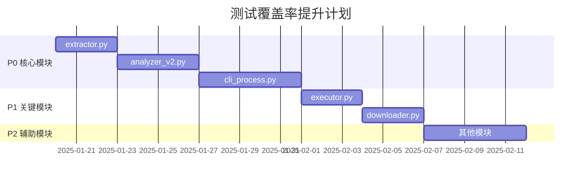

# Video-to-Action 测试覆盖率分析报告

**生成时间**: 2025-01-18  
**分析工具**: pytest + coverage  
**当前总体覆盖率**: **11%**

---

## 1. 当前测试覆盖率统计

### 1.1 总体情况

| 模块 | 语句数 | 未覆盖 | 覆盖率 | 优先级 |
|------|--------|--------|--------|--------|
| **extractor.py** | 115 | 115 | **0%** | 🔴 P0 |
| **analyzer_v2.py** | 271 | 271 | **0%** | 🔴 P0 |
| **cli_process.py** | 306 | 306 | **0%** | 🔴 P0 |
| **executor.py** | 86 | 86 | **0%** | 🟠 P1 |
| **downloader.py** | 75 | 75 | **0%** | 🟠 P1 |
| analyzer.py | 5 | 5 | 0% | 🟡 P2 |
| base_knowledge_base.py | 68 | 68 | 0% | 🟡 P2 |
| cli.py | 98 | 98 | 0% | 🟡 P2 |
| cli_kb.py | 61 | 61 | 0% | 🟡 P2 |
| config_wizard.py | 84 | 84 | 0% | 🟢 P3 |
| douyin_downloader.py | 184 | 184 | 0% | 🟠 P1 |
| greenvideo_downloader.py | 98 | 98 | 0% | 🟡 P2 |
| handbook_exporter.py | 51 | 51 | 0% | 🟢 P3 |
| json_parser.py | 59 | 59 | 0% | 🟠 P1 |
| knowledge_base.py | 190 | 190 | 0% | 🟡 P2 |
| knowledge_base_factory.py | 25 | 25 | 0% | 🟡 P2 |
| mysql_knowledge_base.py | 293 | 293 | 0% | 🟢 P3 |
| reporter.py | 43 | 43 | 0% | 🟡 P2 |
| resolver.py | 43 | 43 | 0% | 🟡 P2 |
| ytdlp_downloader.py | 160 | 160 | 0% | 🟠 P1 |
| **config.py** | 40 | 15 | **62%** | - |
| **exceptions.py** | 39 | 1 | **97%** | - |
| **utils.py** | 35 | 1 | **97%** | - |
| tests/test_config.py | 50 | 1 | 98% | - |
| tests/test_exceptions.py | 87 | 1 | 99% | - |
| tests/test_utils.py | 59 | 3 | 95% | - |
| **总计** | **2626** | **2337** | **11%** | - |

### 1.2 核心模块识别（按优先级）

根据团队要求，以下5个核心模块当前覆盖率为 **0%**：

1. **extractor.py** (115 statements) - 音频转写模块
2. **analyzer_v2.py** (271 statements) - LLM 分析模块
3. **cli_process.py** (306 statements) - 处理流程编排模块
4. **executor.py** (86 statements) - 命令执行模块
5. **downloader.py** (75 statements) - 视频下载模块

---

## 2. 测试优先级建议

### 2.1 优先级排序依据

| 因素 | 权重 | 说明 |
|------|------|------|
| **模块重要性** | 40% | 核心功能 vs 辅助功能 |
| **代码复杂度** | 30% | 函数数量、逻辑分支、错误处理 |
| **外部依赖** | 20% | 需要 Mock 的难度 |
| **历史 Bug 频率** | 10% | Git 提交历史（如有） |

### 2.2 优先级分类

#### 🔴 P0（最高优先级）- 核心功能模块

| 模块 | 重要性 | 复杂度 | 外部依赖 | 推荐理由 |
|------|--------|--------|----------|----------|
| **extractor.py** | ⭐⭐⭐⭐⭐ | ⭐⭐⭐⭐ | ffmpeg, Whisper | 视频处理核心，影响后续所有流程 |
| **analyzer_v2.py** | ⭐⭐⭐⭐⭐ | ⭐⭐⭐⭐⭐ | LLM API | 最核心模块，决定输出质量 |
| **cli_process.py** | ⭐⭐⭐⭐⭐ | ⭐⭐⭐⭐⭐ | 所有模块 | 编排层，端到端测试关键 |

#### 🟠 P1（高优先级）- 关键支撑模块

| 模块 | 重要性 | 复杂度 | 外部依赖 | 推荐理由 |
|------|--------|--------|----------|----------|
| **executor.py** | ⭐⭐⭐⭐ | ⭐⭐⭐ | subprocess | 命令执行安全关键，需要充分测试 |
| **downloader.py** | ⭐⭐⭐⭐ | ⭐⭐⭐ | yt-dlp, 网络 | 下载失败影响用户体验 |
| **json_parser.py** | ⭐⭐⭐ | ⭐⭐ | 无 | LLM 输出解析，容易出bug |
| **ytdlp_downloader.py** | ⭐⭐⭐ | ⭐⭐⭐ | yt-dlp | 主要下载器，需要测试各种边界情况 |

#### 🟡 P2（中优先级）- 辅助功能模块

- base_knowledge_base.py, knowledge_base.py, reporter.py, resolver.py 等

#### 🟢 P3（低优先级）- 可选功能

- config_wizard.py, handbook_exporter.py, mysql_knowledge_base.py 等

---

## 3. 测试计划

### 3.1 模块测试策略

---

### 📦 extractor.py（音频转写模块）

**当前覆盖率**: 0% (115/115 statements)  
**目标覆盖率**: 85%+

#### 单元测试策略

| 测试场景 | 测试点 | 优先级 | 预估用例数 |
|----------|--------|--------|------------|
| **extract_audio** | 正常提取音频 | P0 | 3 |
| | ffmpeg 未安装异常 | P0 | 2 |
| | ffmpeg 执行失败 | P0 | 2 |
| | 输出路径创建 | P1 | 1 |
| **transcribe** | 正常转写（Mock Whisper） | P0 | 5 |
| | 模型缓存机制 | P0 | 3 |
| | 设备自动检测 | P1 | 2 |
| | VAD 过滤 | P1 | 2 |
| | 音频文件不存在 | P0 | 1 |
| **extract_frames** | 正常截取关键帧 | P0 | 3 |
| | ffprobe 未安装 | P0 | 2 |
| | 视频时长获取失败 | P1 | 2 |
| | 帧截取部分失败 | P1 | 2 |
| **process** | 完整流程（音频+转写+抽帧） | P0 | 3 |
| | 音频提取失败容错 | P0 | 2 |
| | 抽帧失败容错 | P1 | 2 |
| **_detect_device** | CUDA 可用 | P1 | 2 |
| | CUDA 不可用回退 CPU | P1 | 1 |
| | 配置指定设备 | P1 | 2 |
| **Model Cache** | 缓存命中 | P1 | 2 |
| | 缓存清理（_trim_model_cache） | P1 | 2 |
| | 并发加载保护 | P2 | 1 |

**单元测试预估**: 40+ 测试用例

#### Mock 策略

```python
# 需要 Mock 的外部依赖
1. shutil.which() - 模拟 ffmpeg/ffprobe 是否安装
2. subprocess.run() - 模拟 ffmpeg/ffprobe 执行
3. faster_whisper.WhisperModel - 模拟 Whisper 模型加载和转写
4. ctranslate2.get_cuda_device_count() - 模拟 CUDA 检测
```

#### 集成测试策略

- 测试 Extractor 与其他模块的集成（如 cli_process 调用）
- 测试完整视频处理流程（需要真实视频文件，建议使用 fixtures）

---

### 📦 analyzer_v2.py（LLM 分析模块）

**当前覆盖率**: 0% (271/271 statements)  
**目标覆盖率**: 80%+

#### 单元测试策略

| 测试场景 | 测试点 | 优先级 | 预估用例数 |
|----------|--------|--------|------------|
| **analyze** | 正常分析（Mock LLM） | P0 | 5 |
| | 缓存命中 | P0 | 3 |
| | 缓存过期 | P1 | 2 |
| | LLM 调用失败回退 | P0 | 3 |
| | 多模态分析（vision_enabled） | P1 | 3 |
| **analyze_async** | 异步分析正常流程 | P0 | 3 |
| | 异步缓存命中 | P1 | 2 |
| | 异步 LLM 调用失败 | P1 | 2 |
| **_call_openai_compatible** | 正常调用 | P0 | 3 |
| | 429 限流重试 | P0 | 3 |
| | 超时重试 | P0 | 3 |
| | 认证失败 | P1 | 2 |
| **_call_openai_compatible_async** | 异步正常调用 | P1 | 2 |
| | 异步重试逻辑 | P1 | 3 |
| **_create_text_prompt** | Prompt 构建 | P1 | 3 |
| | 文本截断 | P1 | 2 |
| **_create_multimodal_prompt** | 多模态 Prompt 构建 | P1 | 3 |
| | 图片编码失败处理 | P2 | 2 |
| **_get_cache_key** | 基于 video_url 的缓存键 | P0 | 3 |
| | 基于 video_path 的缓存键 | P1 | 2 |
| | 基于文本的缓存键（兜底） | P1 | 2 |
| **缓存管理** | 缓存加载 | P1 | 2 |
| | 缓存保存 | P1 | 2 |
| | 缓存清理（TTL） | P1 | 2 |
| **_build_mock_response** | 回退响应格式 | P1 | 1 |

**单元测试预估**: 55+ 测试用例

#### Mock 策略

```python
# 需要 Mock 的外部依赖
1. httpx.post() / httpx.AsyncClient.post() - 模拟 LLM API 调用
2. httpx.TimeoutException - 模拟超时
3. LLM 响应格式 - 模拟各种 LLM 输出（正确、错误、不完整）
4. base64.b64encode() - 测试图片编码
5. json.dump() / json.load() - 测试缓存读写
```

#### 集成测试策略

- 测试 AnalyzerV2 与 JsonParser 的集成
- 测试缓存机制跨会话 persistence
- 测试多模态分析完整流程（需要真实图片）

---

### 📦 cli_process.py（处理流程编排模块）

**当前覆盖率**: 0% (306/306 statements)  
**目标覆盖率**: 75%+

#### 单元测试策略

| 测试场景 | 测试点 | 优先级 | 预估用例数 |
|----------|--------|--------|------------|
| **_get_local_or_download** | 本地文件 | P0 | 3 |
| | 下载成功 | P0 | 3 |
| | 下载失败 | P0 | 2 |
| | URL 验证 | P1 | 2 |
| **_extract_content** | 正常提取 | P0 | 3 |
| | 提取失败异常处理 | P0 | 2 |
| **handle_process** | 完整流程（Mock 所有依赖） | P0 | 5 |
| | extract 模式（只提取不分析） | P0 | 2 |
| | observe 模式（只分析不执行） | P0 | 2 |
| | confirm 模式 | P1 | 2 |
| | 各种异常处理 | P0 | 5 |
| **handle_batch** | 批量处理正常流程 | P0 | 3 |
| | URL 文件不存在 | P0 | 1 |
| | URL 文件为空 | P0 | 1 |
| | 部分视频处理失败 | P1 | 2 |
| | 汇总报告生成 | P1 | 2 |
| **_analyze_content** | 分析调用 | P1 | 2 |
| **_execute_plan** | 执行计划 | P1 | 2 |
| **_auto_resolve** | 自动修复失败命令 | P1 | 3 |
| **_generate_report** | 报告生成 | P1 | 2 |
| **_warmup_models** | 模型预热 | P2 | 2 |
| | 预热状态缓存 | P2 | 2 |
| **进度条** | tqdm 可用 | P2 | 1 |
| | tqdm 不可用 | P2 | 1 |
| | DEBUG 模式 | P2 | 1 |

**单元测试预估**: 55+ 测试用例

#### Mock 策略

```python
# 需要 Mock 的外部依赖
1. Extractor - Mock 视频提取
2. AnalyzerV2 - Mock LLM 分析
3. Executor - Mock 命令执行
4. Reporter - Mock 报告生成
5. download_video() - Mock 视频下载
6. KnowledgeBase - Mock 知识库保存
7. tqdm - Mock 进度条（可选）
```

#### 集成测试策略

- 端到端测试：模拟完整 process 流程（从下载到报告）
- 端到端测试：批量处理流程
- 错误恢复测试：验证各种异常情况的处理

---

### 📦 executor.py（命令执行模块）

**当前覆盖率**: 0% (86/86 statements)  
**目标覆盖率**: 90%+

#### 单元测试策略

| 测试场景 | 测试点 | 优先级 | 预估用例数 |
|----------|--------|--------|------------|
| **execute** | 正常命令执行 | P0 | 5 |
| | 危险命令拦截 | P0 | 5 |
| | 需要确认的命令 | P0 | 3 |
| | 交互式工具检测 | P0 | 3 |
| | 命令超时 | P0 | 2 |
| | 命令执行异常 | P0 | 3 |
| | 安装命令格式校验 | P1 | 3 |
| **execute_plan** | 完整计划执行 | P0 | 3 |
| | install_commands 失败中止 | P0 | 2 |
| | config_steps 失败中止 | P0 | 2 |
| | run_commands 失败不中止 | P1 | 2 |
| | 交互式工具跳过 | P1 | 2 |
| **_needs_confirm** | 远程脚本检测 | P1 | 3 |
| | 系统软件安装检测 | P1 | 2 |
| | 环境变量修改检测 | P1 | 2 |
| **_is_interactive_tool** | 已知交互式工具 | P1 | 3 |
| | 非交互式工具 | P1 | 1 |
| **_is_valid_install_command** | 合法安装命令 | P1 | 5 |
| | 不合法命令（如 npx 运行） | P1 | 3 |

**单元测试预估**: 50+ 测试用例

#### Mock 策略

```python
# 需要 Mock 的外部依赖
1. subprocess.run() - 模拟命令执行
2. subprocess.TimeoutExpired - 模拟超时
3. shlex.split() - 测试命令解析
4. config.get() - Mock 配置读取
```

#### 集成测试策略

- 测试真实命令执行（安全的命令，如 `echo`, `pwd`）
- 测试危险命令拦截（如 `rm -rf /`）

---

### 📦 downloader.py（视频下载模块）

**当前覆盖率**: 0% (75/75 statements)  
**目标覆盖率**: 85%+

#### 单元测试策略

| 测试场景 | 测试点 | 优先级 | 预估用例数 |
|----------|--------|--------|------------|
| **download_video** | 抖音下载成功 | P0 | 3 |
| | 抖音失败回退 yt-dlp | P0 | 3 |
| | yt-dlp 下载成功 | P0 | 3 |
| | 所有下载器失败 | P0 | 2 |
| | 断点续传（缓存命中） | P0 | 3 |
| | GreenVideo 备选方案 | P1 | 2 |
| **_check_existing_download** | 精确匹配（video_id） | P0 | 3 |
| | 平台前缀匹配（兜底） | P1 | 2 |
| | 文件大小校验 | P1 | 2 |
| | 无缓存文件 | P1 | 1 |
| **_extract_video_id_from_url** | modal_id 参数 | P1 | 2 |
| | /video/ 路径 | P1 | 2 |
| | 最后一段数字 | P2 | 2 |
| | 无法提取 | P2 | 1 |
| **平台检测** | 抖音 URL | P1 | 3 |
| | YouTube URL | P1 | 2 |
| | B站 URL | P1 | 2 |
| | 其他平台 | P2 | 2 |

**单元测试预估**: 40+ 测试用例

#### Mock 策略

```python
# 需要 Mock 的外部依赖
1. DouyinDownloader.download() - Mock 抖音下载
2. YtDlpDownloader.download() - Mock yt-dlp 下载
3. GreenVideoDownloader.download() - Mock GreenVideo 下载
4. Path.exists() - 模拟缓存文件检查
5. detect_video_platform() - Mock 平台检测
```

#### 集成测试策略

- 测试下载器降级策略（主下载器失败 → 备选下载器）
- 测试断点续传逻辑

---

## 4. Mock 策略总结

### 4.1 外部依赖分类

| 依赖类型 | 模块 | Mock 难度 | 推荐策略 |
|----------|------|-----------|----------|
| **LLM API** | analyzer_v2.py | ⭐⭐⭐⭐⭐ | 完整 Mock 响应，测试各种返回格式 |
| **Whisper 模型** | extractor.py | ⭐⭐⭐⭐ | Mock 模型加载，返回预定义转写结果 |
| **ffmpeg/ffprobe** | extractor.py | ⭐⭐⭐ | Mock subprocess.run()，提供假输出 |
| **subprocess 执行** | executor.py | ⭐⭐ | Mock subprocess.run()，模拟成功/失败 |
| **httpx (HTTP)** | analyzer_v2.py | ⭐⭐⭐ | Mock 同步/异步请求，模拟重试 |
| **视频下载器** | downloader.py | ⭐⭐⭐ | Mock 各下载器返回，测试降级逻辑 |
| **文件系统** | 所有模块 | ⭐ | 使用 tempfile + pytest fixtures |

### 4.2 Mock 最佳实践

1. **使用 pytest-mock (mocker fixture)** - 简洁的 Mock 语法
2. **创建 fixture 工厂** - 复用常见的 Mock 对象
3. **参数化测试** - 覆盖多种输入组合
4. **隔离外部依赖** - 确保测试不依赖真实 API/网络/硬件

---

## 5. 预估工作量

### 5.1 测试用例开发工作量

| 模块 | 测试用例数 | 复杂度 | 预估工作量（人日） |
|------|------------|--------|-------------------|
| extractor.py | 40 | ⭐⭐⭐⭐ | 3.0 |
| analyzer_v2.py | 55 | ⭐⭐⭐⭐⭐ | 4.0 |
| cli_process.py | 55 | ⭐⭐⭐⭐⭐ | 4.5 |
| executor.py | 50 | ⭐⭐⭐ | 2.5 |
| downloader.py | 40 | ⭐⭐⭐ | 2.5 |
| json_parser.py | 20 | ⭐⭐ | 1.0 |
| ytdlp_downloader.py | 30 | ⭐⭐⭐ | 2.0 |
| **合计** | **290+** | - | **19.5 人日** |

### 5.2 分阶段实施计划

#### 第一阶段（P0 核心模块）- 10.5 人日

- Week 1-2: extractor.py (3 人日)
- Week 2-3: analyzer_v2.py (4 人日)
- Week 3-4: cli_process.py (4.5 人日)

**里程碑**: 核心功能覆盖率达到 80%+

#### 第二阶段（P1 关键模块）- 6.0 人日

- Week 5: executor.py (2.5 人日)
- Week 5-6: downloader.py (2.5 人日)
- Week 6: json_parser.py + ytdlp_downloader.py (3 人日)

**里程碑**: 关键模块覆盖率达到 85%+

#### 第三阶段（P2/P3 辅助模块）- 3.0 人日

- Week 7-8: 其他模块（reporter.py, resolver.py, 等）

**里程碑**: 总体覆盖率达到 70%+

---

## 6. 推荐测试工具与框架

### 6.1 现有工具

- ✅ **pytest** - 测试框架（已配置）
- ✅ **pytest-cov** - 覆盖率报告（已配置）
- ❌ **pytest-mock** - Mock 工具（建议添加）
- ❌ **pytest-asyncio** - 异步测试（建议添加，analyzer_v2.py 需要）

### 6.2 推荐添加的依赖

```toml
[project.optional-dependencies]
dev = [
    "pytest-mock>=3.12.0",
    "pytest-asyncio>=0.23.0",
    "pytest-xdist>=3.5.0",  # 并行测试
    "coverage>=7.0.0",       # 详细覆盖率报告
]
```

---

## 7. 下一步行动建议

### 7.1 立即行动

1. **安装测试依赖** - `pip install pytest-mock pytest-asyncio`
2. **修改 pyproject.toml** - 降低 `cov-fail-under` 到 50%（当前 5% 太宽松）
3. **创建测试文件** - 按模块添加 `test_extractor.py`, `test_analyzer_v2.py` 等

### 7.2 测试编写优先级

**Week 1**:
- 编写 `test_extractor.py` 基础测试用例（Mock ffmpeg）
- 编写 `test_executor.py` 安全测试（危险命令拦截）

**Week 2**:
- 编写 `test_analyzer_v2.py` Mock LLM API
- 编写 `test_downloader.py` 测试下载降级逻辑

**Week 3**:
- 编写 `test_cli_process.py` 编排流程测试
- 集成测试：端到端流程验证

### 7.3 持续集成建议

- 配置 pre-commit hook 运行测试
- 配置 GitHub Actions / CI 自动运行测试
- 设置覆盖率门禁（逐步提升：50% → 70% → 85%）

---

## 8. 风险与注意事项

### 8.1 测试风险

| 风险 | 影响 | 缓解措施 |
|------|------|----------|
| LLM API 响应不稳定 | 测试不稳定 | 完整 Mock LLM 响应 |
| ffmpeg 环境依赖 | 无法运行测试 | Mock subprocess.run() |
| 异步代码测试复杂 | 测试覆盖率低 | 使用 pytest-asyncio |
| 测试数据准备繁琐 | 开发效率低 | 创建 fixtures 工厂 |

### 8.2 注意事项

1. **不要测试第三方库** - 只测试自己的逻辑
2. **Mock 要适度** - 不要 Mock 过度导致测试失去意义
3. **保持测试独立** - 每个测试应该能独立运行
4. **测试命名规范** - 使用 `test_<功能>_<场景>_<期望>` 格式

---

## 9. 附录：覆盖率提升路线图



**目标覆盖率里程碑**:
- 🎯 **2025-01-25**: 核心模块覆盖率 80%+
- 🎯 **2025-02-01**: 关键模块覆盖率 85%+
- 🎯 **2025-02-10**: 总体覆盖率 70%+

---

**报告结束**

*生成工具: pytest + coverage + 人工分析*  
*下一步: 根据本报告开始编写测试用例*
