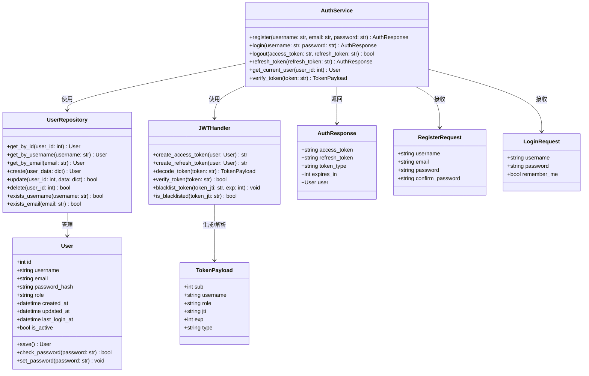
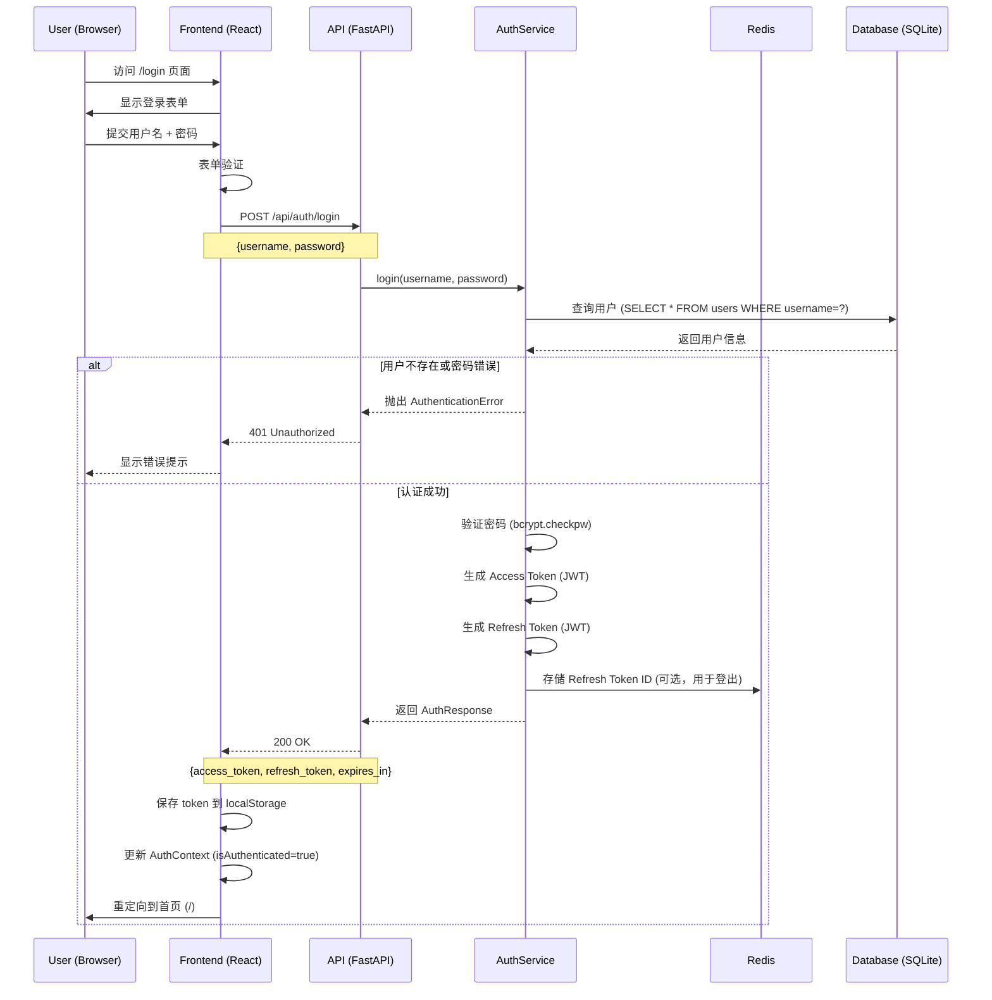
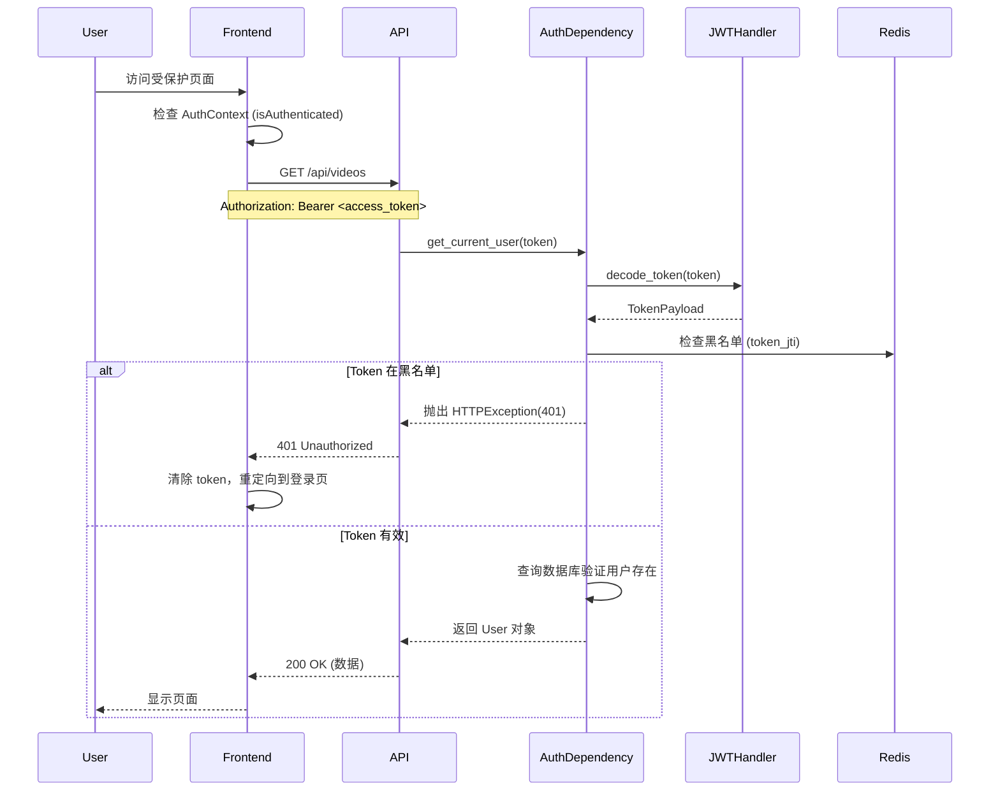
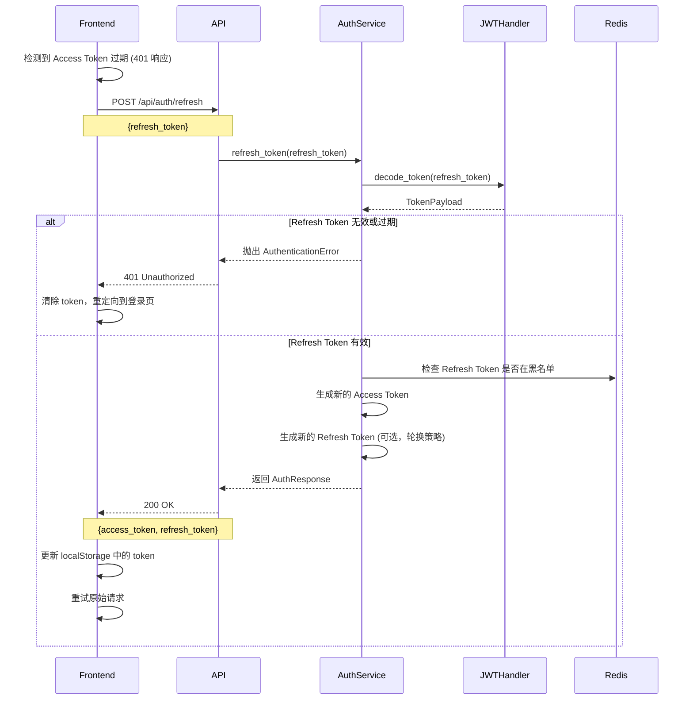
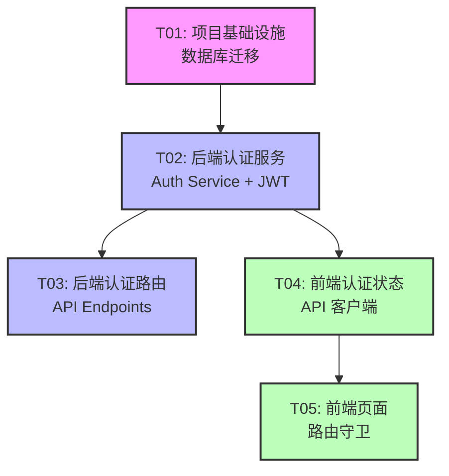

# P2 用户认证系统 - 架构设计文档

**项目**: Video-to-Action  
**阶段**: P2 (功能开发)  
**功能**: 用户认证系统  
**作者**: Bob (软件架构师)  
**日期**: 2026-01-15  

---

## Part A: 系统设计

### 1. Implementation Approach

#### 1.1 核心技术方案

**认证方式选择：JWT Token + Redis 黑名单**

- **JWT (JSON Web Token)**: 无状态认证，适合 API 服务，避免每次请求查询数据库
- **Access Token**: 短期有效（15分钟），用于 API 请求认证
- **Refresh Token**: 长期有效（7天），存在 HttpOnly Cookie 中，用于获取新的 Access Token
- **Redis 黑名单**: 存储已登出的 Token ID，实现服务端强制失效

**技术栈**：

| 层级 | 技术选型 | 理由 |
|------|---------|------|
| 后端框架 | FastAPI | 项目已使用，保持一致性 |
| 认证库 | PyJWT + python-jose | JWT 生成/验证 |
| 密码哈希 | bcrypt (passlib) | 安全、成熟、自动加盐 |
| 数据库 | SQLite | 项目已使用，新增 users 表 |
| 缓存/黑名单 | Redis | 项目已配置，复用现有连接 |
| 前端状态 | React Context | 项目已用 React，无需引入新依赖 |
| 路由守卫 | React Router | 项目已使用 |

#### 1.2 架构模式

**分层架构**：

```
┌─────────────────────────────────────────────────────┐
│                   Frontend (React)                   │
│  ┌────────────┐  ┌────────────┐  ┌────────────┐    │
│  │  Pages     │  │  Context   │  │  API       │    │
│  │  /login    │  │  Auth      │  │  Client    │    │
│  │  /register │  │  Provider  │  │  (Axios)   │    │
│  └────────────┘  └────────────┘  └────────────┘    │
└─────────────────────────────────────────────────────┘
                        ↓ HTTPS
┌─────────────────────────────────────────────────────┐
│              Backend (FastAPI)                       │
│  ┌────────────┐  ┌────────────┐  ┌────────────┐    │
│  │  /api/auth │  │  Auth      │  │  User      │    │
│  │  /register │  │  Service   │  │  Repository │    │
│  │  /login    │  │  (JWT)     │  │  (DB)      │    │
│  └────────────┘  └────────────┘  └────────────┘    │
└─────────────────────────────────────────────────────┘
                        ↓
┌─────────────────────────────────────────────────────┐
│              Data Layer                              │
│  ┌────────────┐  ┌────────────┐                    │
│  │  SQLite    │  │  Redis     │                    │
│  │  (users)   │  │  (blacklist)│                    │
│  └────────────┘  └────────────┘                    │
└─────────────────────────────────────────────────────┘
```

#### 1.3 关键设计决策

1. **向后兼容**：现有 API 端点保持无需认证，通过环境变量 `ENABLE_AUTH=true` 逐步启用
2. **用户表独立于现有表**：新增 `users` 表，现有 `user_preferences` 表的 `user_id` 字段改为关联 `users.id`
3. **Token 不存数据库**：JWT 本身包含用户信息，只需在 Redis 存黑名单（登出/强制失效）
4. **Refresh Token 存 Cookie**：HttpOnly + Secure + SameSite，防止 XSS 窃取

---

### 2. File List

#### 2.1 后端文件 (Backend)

```
api/
├── main.py                          # 修改：集成认证中间件
├── auth/
│   ├── __init__.py                  # 认证模块入口
│   ├── models.py                    # Pydantic 请求/响应模型
│   ├── service.py                   # 认证业务逻辑（注册/登录/验证）
│   ├── jwt_handler.py              # JWT 生成/验证/刷新
│   ├── dependencies.py             # FastAPI 依赖注入（get_current_user）
│   └── router.py                   # /api/auth/* 路由定义
├── repositories/
│   └── user_repository.py          # 用户数据访问层（数据库操作）
└── middleware/
    └── auth_middleware.py          # 可选：全局认证中间件

requirements.txt                    # 修改：新增 PyJWT, python-jose, passlib
.env.example                        # 修改：新增 JWT_SECRET, ENABLE_AUTH 等配置
```

#### 2.2 前端文件 (Frontend)

```
frontend/src/
├── api/
│   └── client.ts                   # 修改：添加 token 拦截器
├── context/
│   └── AuthContext.tsx             # 新增：认证状态管理（Context + Provider）
├── types/
│   └── index.ts                    # 修改：新增 User, AuthResponse 类型
├── pages/
│   ├── LoginPage.tsx               # 新增：登录页面
│   ├── RegisterPage.tsx            # 新增：注册页面
│   └── ProfilePage.tsx            # 新增：用户资料页面（可选）
├── components/
│   ├── ProtectedRoute.tsx          # 新增：路由守卫组件
│   └── AuthLayout.tsx             # 新增：认证页面布局（登录/注册共用）
├── hooks/
│   └── useAuth.ts                  # 新增：认证相关 hooks
└── App.tsx                         # 修改：添加 AuthProvider, 路由
```

#### 2.3 数据库迁移

```
database/
└── migrations/
    └── 001_create_users_table.sql  # 新增：users 表 + 索引
```

---

### 3. Data Structures and Interfaces

#### 3.1 Mermaid Class Diagram



#### 3.2 API 接口定义

**请求模型**：

```python
# api/auth/models.py

from pydantic import BaseModel, EmailStr, Field

class RegisterRequest(BaseModel):
    username: str = Field(..., min_length=3, max_length=50, regex="^[a-zA-Z0-9_]+$")
    email: EmailStr
    password: str = Field(..., min_length=8, max_length=128)
    confirm_password: str = Field(..., min_length=8, max_length=128)

class LoginRequest(BaseModel):
    username: str = Field(...)
    password: str = Field(...)
    remember_me: bool = False

class RefreshTokenRequest(BaseModel):
    refresh_token: str = Field(...)

class ChangePasswordRequest(BaseModel):
    old_password: str = Field(...)
    new_password: str = Field(..., min_length=8, max_length=128)
    confirm_password: str = Field(..., min_length=8, max_length=128)
```

**响应模型**：

```python
class AuthResponse(BaseModel):
    access_token: str
    refresh_token: str
    token_type: str = "bearer"
    expires_in: int = 900  # 15 minutes in seconds

class UserResponse(BaseModel):
    id: int
    username: str
    email: str
    role: str
    created_at: datetime
    last_login_at: Optional[datetime]

class TokenVerifyResponse(BaseModel):
    valid: bool
    user: Optional[UserResponse]
```

---

### 4. Program Call Flow

#### 4.1 用户登录流程



#### 4.2 API 请求认证流程



#### 4.3 Token 刷新流程



---

### 5. Anything UNCLEAR

#### 5.1 需要确认的问题

1. **密码重置功能**：
   - P2 阶段是否包含邮件发送功能？
   - 如果不包含，密码重置可以延后到 P3

2. **用户角色权限**：
   - 除 admin/user 外，是否需要其他角色（如 moderator）？
   - admin 权限具体包含哪些操作？

3. **多设备登录**：
   - 是否允许同一用户多设备同时登录？
   - 如果允许，Refresh Token 如何管理？

4. **现有数据迁移**：
   - `user_preferences` 表的 `user_id` 字段当前是 TEXT，如何迁移到关联 `users.id`？
   - 是否需要为现有数据创建默认用户？

5. **认证范围**：
   - 哪些 API 端点需要立即启用认证？
   - 是否提供"公开访问"和"登录访问"两种模式？

#### 5.2 假设和妥协

1. **P2 阶段不包含密码重置**：用户可以通过联系 admin 重置密码
2. **仅两种角色**：admin（全部权限）和 user（基本权限）
3. **允许多设备登录**：每个设备获得独立的 Refresh Token
4. **逐步启用认证**：通过环境变量控制，不影响现有功能
5. **user_preferences 迁移**：新增 `user_id_int` 字段，关联 `users.id`，旧的 `user_id` 保留兼容性

---

## Part B: Task Decomposition

### 6. Required Packages

#### 6.1 Python (Backend)

```
# 添加到 requirements.txt

# JWT 认证
PyJWT==2.8.0
python-jose[cryptography]==3.3.0

# 密码哈希
passlib[bcrypt]==1.7.4

# 可选：增强安全性
python-multipart==0.0.6  # 支持 form 数据
itsdangerous==2.1.2      # 用于生成安全 token（密码重置）
```

#### 6.2 Node.js (Frontend)

```json
// package.json 无需新增依赖
// React 18 + React Router 已满足需求

// 可选：增强体验
"react-toastify": "^9.1.3"  // 提示消息
```

---

### 7. Task List (ordered by dependency)

#### **T01: 项目基础设施 + 数据库迁移**

**Task ID**: T01  
**Task Name**: 项目基础设施与数据库设计  
**Source Files**:
- `database/migrations/001_create_users_table.sql` (新建)
- `video_to_action/knowledge_base.py` (修改)
- `api/auth/models.py` (新建)
- `requirements.txt` (修改)
- `.env.example` (修改)

**Dependencies**: 无  
**Priority**: P0

**描述**:
1. 创建 `users` 表 SQL 迁移脚本（包含索引）
2. 修改 `KnowledgeBase` 类，添加 `users` 表初始化
3. 定义 Pydantic 请求/响应模型（`api/auth/models.py`）
4. 添加依赖包到 `requirements.txt`
5. 添加 JWT 配置到 `.env.example`

**验收标准**:
- `users` 表成功创建（包含必要字段和索引）
- `user_preferences` 表添加 `user_id_int` 外键字段
- Pydantic 模型可以被正确导入

---

#### **T02: 后端认证服务 (Auth Service + JWT Handler)**

**Task ID**: T02  
**Task Name**: 后端认证服务实现  
**Source Files**:
- `api/auth/service.py` (新建)
- `api/auth/jwt_handler.py` (新建)
- `api/auth/user_repository.py` (新建)
- `api/auth/dependencies.py` (新建)

**Dependencies**: T01  
**Priority**: P0

**描述**:
1. 实现 `JWTHandler`：生成/验证 Access Token 和 Refresh Token
2. 实现 `UserRepository`：用户 CRUD 操作（数据库访问层）
3. 实现 `AuthService`：注册、登录、登出、刷新 Token 业务逻辑
4. 实现 `get_current_user` 依赖注入函数

**验收标准**:
- 可以生成有效的 JWT Token
- 可以验证 Token 并提取用户信息
- 用户注册成功，密码正确哈希
- 用户登录成功，返回 Token
- Token 验证失败返回 401

---

#### **T03: 后端认证路由 + 中间件集成**

**Task ID**: T03  
**Task Name**: 后端路由与中间件  
**Source Files**:
- `api/auth/router.py` (新建)
- `api/main.py` (修改)
- `api/middleware/auth_middleware.py` (新建，可选)

**Dependencies**: T02  
**Priority**: P0

**描述**:
1. 实现 `/api/auth/*` 路由（`router.py`）
2. 修改 `main.py`，注册 auth 路由
3. 集成认证中间件（可选，用于全局保护）
4. 添加 Redis Token 黑名单功能

**验收标准**:
- `POST /api/auth/register` 可以注册新用户
- `POST /api/auth/login` 可以登录并返回 Token
- `POST /api/auth/logout` 可以登出（加入黑名单）
- `POST /api/auth/refresh` 可以刷新 Token
- `GET /api/auth/me` 可以获取当前用户信息
- 受保护的端点返回 401（如果未提供有效 Token）

---

#### **T04: 前端认证状态管理 + API 客户端**

**Task ID**: T04  
**Task Name**: 前端认证状态与 API 集成  
**Source Files**:
- `frontend/src/context/AuthContext.tsx` (新建)
- `frontend/src/api/client.ts` (修改)
- `frontend/src/types/index.ts` (修改)
- `frontend/src/hooks/useAuth.ts` (新建)

**Dependencies**: T02 (API 已实现)  
**Priority**: P1

**描述**:
1. 实现 `AuthContext`：管理认证状态（isAuthenticated, user, token）
2. 修改 `api/client.ts`：添加 Axios 请求拦截器（自动携带 Token）
3. 添加 Token 过期自动刷新逻辑
4. 定义 TypeScript 类型（`User`, `AuthResponse` 等）

**验收标准**:
- `AuthProvider` 可以正确管理认证状态
- API 请求自动携带 `Authorization` Header
- Token 过期时自动刷新（无感刷新）
- 刷新失败则跳转到登录页

---

#### **T05: 前端页面 + 路由守卫**

**Task ID**: T05  
**Task Name**: 前端页面与路由保护  
**Source Files**:
- `frontend/src/pages/LoginPage.tsx` (新建)
- `frontend/src/pages/RegisterPage.tsx` (新建)
- `frontend/src/components/ProtectedRoute.tsx` (新建)
- `frontend/src/components/Layout.tsx` (修改)
- `frontend/src/App.tsx` (修改)

**Dependencies**: T04  
**Priority**: P1

**描述**:
1. 实现登录页面（`LoginPage.tsx`）：表单 + 验证 + 提交
2. 实现注册页面（`RegisterPage.tsx`）：表单 + 验证 + 提交
3. 实现 `ProtectedRoute` 组件：未登录跳转登录页
4. 修改 `Layout.tsx`：添加用户菜单（头像 + 登出按钮）
5. 修改 `App.tsx`：添加 AuthProvider，配置路由

**验收标准**:
- 访问 `/login` 显示登录页
- 访问 `/register` 显示注册页
- 未登录访问受保护路由跳转到 `/login`
- 登录成功跳转首页
- 登出成功清除 Token 并跳转登录页
- 用户菜单显示用户名，点击登出有效

---

### 8. Shared Knowledge

#### 8.1 跨文件约定

**JWT Token 结构**:

```json
{
  "sub": 123,           // 用户 ID
  "username": "john",
  "role": "user",
  "jti": "uuid",        // Token 唯一 ID（用于黑名单）
  "exp": 1705309200,    // 过期时间戳
  "type": "access"      // 或 "refresh"
}
```

**API 响应格式**:

```json
{
  "code": 0,            // 0=成功，非0=错误
  "data": {...},
  "message": "success"
}
```

**错误码规范**:

| 错误码 | 含义 |
|--------|------|
| 0      | 成功 |
| 400    | 请求参数错误 |
| 401    | 未认证/Token 无效 |
| 403    | 无权限 |
| 409    | 用户名/邮箱已存在 |
| 500    | 服务器错误 |

**Token 存储位置**:

- **Access Token**: `localStorage` (key: `access_token`)
- **Refresh Token**: HttpOnly Cookie（由后端 Set-Cookie 设置）

**环境变量**:

```bash
# .env

# JWT
JWT_SECRET=your-secret-key-change-in-production
JWT_ALGORITHM=HS256
ACCESS_TOKEN_EXPIRE_MINUTES=15
REFRESH_TOKEN_EXPIRE_DAYS=7

# Auth
ENABLE_AUTH=false  # 逐步启用：false -> true
```

#### 8.2 安全注意事项

1. **密码策略**:
   - 最小 8 位，包含大小写字母 + 数字 + 特殊字符（可选）
   - 使用 bcrypt 哈希（自动加盐，cost factor=12）

2. **HTTPS**:
   - 生产环境必须使用 HTTPS（防止 Token 被窃听）
   - 本地开发可使用 HTTP

3. **Rate Limiting**:
   - 登录接口限制：每 IP 每分钟 5 次尝试
   - 使用 Redis 实现（参考 `api/cache.py`）

4. **CORS**:
   - 生产环境限制为前端域名
   - 开发环境允许 `localhost:3000`

---

### 9. Task Dependency Graph



**依赖说明**:
- **T01** 是基础设施，必须最先完成
- **T02** 依赖 T01（数据库表已创建）
- **T03** 依赖 T02（Auth Service 已实现）
- **T04** 可以与 T03 并行（Mock API 响应）
- **T05** 依赖 T04（AuthContext 已实现）

**建议执行顺序**: T01 → T02 → (T03 + T04 并行) → T05

---

## Appendix A: Database Schema (users table)

```sql
-- database/migrations/001_create_users_table.sql

CREATE TABLE IF NOT EXISTS users (
    id INTEGER PRIMARY KEY AUTOINCREMENT,
    username TEXT NOT NULL UNIQUE,
    username_normalized TEXT NOT NULL UNIQUE,  -- 小写，用于不区分大小写查询
    email TEXT NOT NULL UNIQUE,
    email_normalized TEXT NOT NULL UNIQUE,      -- 小写
    password_hash TEXT NOT NULL,
    role TEXT NOT NULL DEFAULT 'user',          -- 'user' or 'admin'
    is_active BOOLEAN NOT NULL DEFAULT 1,
    created_at TIMESTAMP DEFAULT CURRENT_TIMESTAMP,
    updated_at TIMESTAMP DEFAULT CURRENT_TIMESTAMP,
    last_login_at TIMESTAMP,
    login_count INTEGER DEFAULT 0
);

CREATE INDEX IF NOT EXISTS idx_users_username ON users(username);
CREATE INDEX IF NOT EXISTS idx_users_email ON users(email);
CREATE INDEX IF NOT EXISTS idx_users_role ON users(role);

-- 修改 user_preferences 表，添加外键关联
ALTER TABLE user_preferences ADD COLUMN user_id_int INTEGER REFERENCES users(id) ON DELETE CASCADE;

CREATE INDEX IF NOT EXISTS idx_user_preferences_user_id_int ON user_preferences(user_id_int);
```

---

## Appendix B: API Endpoints Summary

| Method | Endpoint | Description | Auth Required |
|--------|----------|-------------|---------------|
| POST   | `/api/auth/register` | 用户注册 | No |
| POST   | `/api/auth/login` | 用户登录 | No |
| POST   | `/api/auth/logout` | 用户登出 | Yes |
| POST   | `/api/auth/refresh` | 刷新 Token | No (需要 Refresh Token) |
| GET    | `/api/auth/me` | 获取当前用户 | Yes |
| GET    | `/api/auth/verify` | 验证 Token | No |

---

## Conclusion

本设计文档提供了完整的用户认证系统方案，包括：
- JWT Token 认证（无状态、可扩展）
- 安全的密码存储（bcrypt）
- Redis Token 黑名单（支持登出）
- React Context 状态管理
- 路由守卫（未登录跳转）
- 5 个任务的实现计划（按依赖排序）

**下一步**: 工程师可以按照 T01 → T02 → T03/T04 (并行) → T05 的顺序实现。
